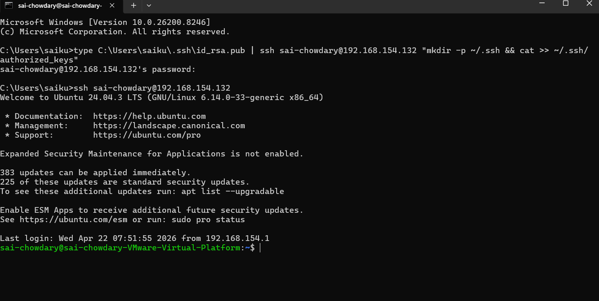

Task 1: Server Setup & SSH Configuration
Objective
To configure secure SSH access using key-based authentication.
Steps Performed
1. Installed SSH Server
sudo apt install openssh-server -y

2. Generated SSH Key (on host)
ssh-keygen -t rsa -b 4096

3. Copied Public Key to Server
ssh-copy-id sai-chowdary@192.168.154.132

4. Disabled Password Authentication
sudo nano /etc/ssh/sshd_config

Set:
PasswordAuthentication no
5. Restarted SSH Service

sudo systemctl restart ssh

Outcome
Successfully connected to the server using SSH key-based authentication without password.

Screenshot:

