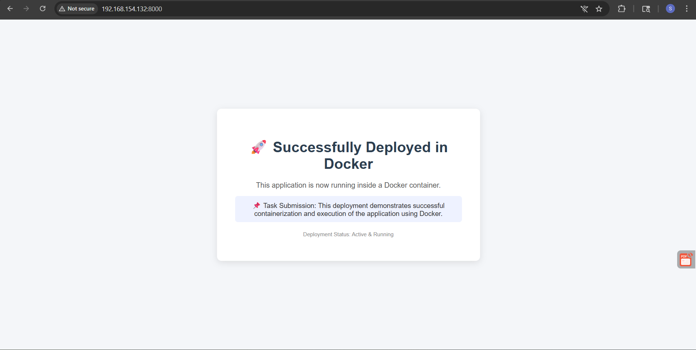

# Task 2: Docker Installation & Application Deployment

## Objective

To deploy a containerized web application using Docker and make it accessible via a browser.

---

## 📦 Files Used

* `Dockerfile`
* `index.html`

---

---

## ⚙️ Steps Performed

### 1. Install Docker

```bash
sudo apt update
sudo apt install docker.io -y
```

### 2. Build Docker Image

```bash
docker build -t web-app .
```

### 3. Run Docker Container

```bash
docker run -d -p 8000:80 web-app
```

---

## 🌐 Application Access

The application is accessible at:

```
http://192.168.154.132:8000
```

---

## ✅ Outcome

* Docker image successfully built
* Container is running
* Application accessible via browser

---

## 📸 Screenshot


