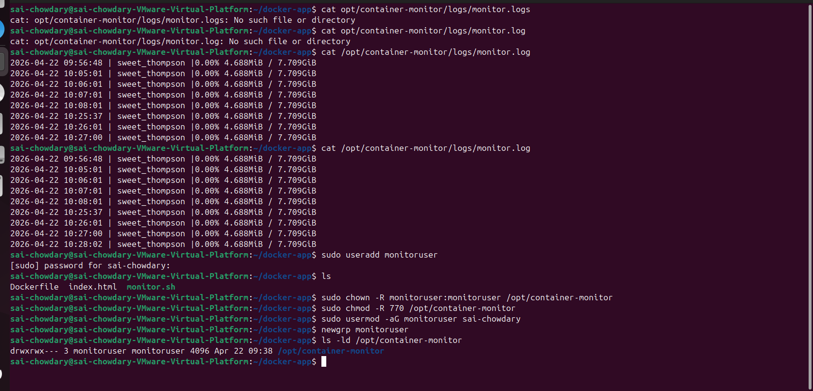

# Task 3: Container Monitoring

## Objective

To monitor Docker container CPU and memory usage, log the data with timestamps, and automate the process using a cron job.

---

## 📂 Monitoring Directory

Logs are stored in:

```id="u7dcsn"
/opt/container-monitor/logs/monitor.log
```

## ⚙️ Steps Performed

### 1. Created Monitoring Directory

```bash id="r9w1qv"
sudo mkdir -p /opt/container-monitor/logs
```

---

### 2. Made Script Executable

```bash id="5f6bpg"
chmod +x monitor.sh
```

---

### 3. Tested Script Manually

```bash id="b2pqdn"
./monitor.sh
```

---

### 4. Automated Using Cron Job

```bash id="iyjoz2"
crontab -e
```

Added:

```bash id="9ozc0w"
* * * * * /home/sai-chowdary/docker-app/monitor.sh
```

---

## 📊 Sample Log Output

```text id="p2hvfh"
2026-04-22 11:30:01 | web-app | 0.00% 2.3MiB / 100MiB
2026-04-22 11:31:01 | web-app | 0.01% 2.4MiB / 100MiB
```

---

## ✅ Outcome

* CPU and memory usage captured successfully
* Logs stored with timestamps
* Monitoring automated using cron (every 1 minute)

---

## 📸 Screenshot


