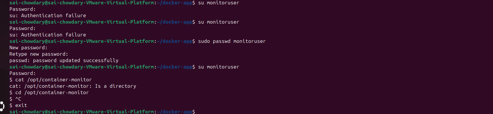
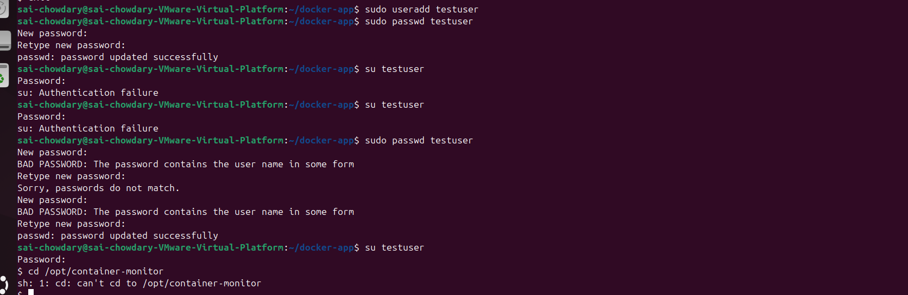

# Task 4: Secure Monitoring Logs

## Objective

To secure monitoring logs by restricting access using a dedicated user and proper file permissions.

---

## 📂 Monitoring Directory

```bash id="n8lxr8"
/opt/container-monitor
```

---

## ⚙️ Steps Performed

### 1. Created Dedicated User

```bash id="6n6d4h"
sudo useradd monitoruser
```

---

### 2. Assigned Ownership to Monitoring Directory

```bash id="bg9qyr"
sudo chown -R monitoruser:monitoruser /opt/container-monitor
```

---

### 3. Set Permissions

```bash id="2qz5kz"
sudo chmod -R 770 /opt/container-monitor
```

---

### 4. Added Existing User to Group

```bash id="bq5u0c"
sudo usermod -aG monitoruser sai-chowdary
```

---

## 🔐 Access Control Verification

### ✅ Allowed Access (monitoruser)

```bash id="xtz7l1"
su monitoruser
cd /opt/container-monitor
```

✔ Access granted

---

### ❌ Restricted Access (other users)

```bash id="pj6w7u"
sudo useradd testuser
su testuser
cd /opt/container-monitor
```

❌ Permission denied

---

## 🧠 Explanation

* `monitoruser` owns the directory
* Permission `770` allows:

  * Owner → full access
  * Group → full access
  * Others → no access

---

## ✅ Outcome

* Monitoring logs secured successfully
* Unauthorized users cannot access logs
* Only authorized users have access

---

## 📸 Screenshot



Verification:


